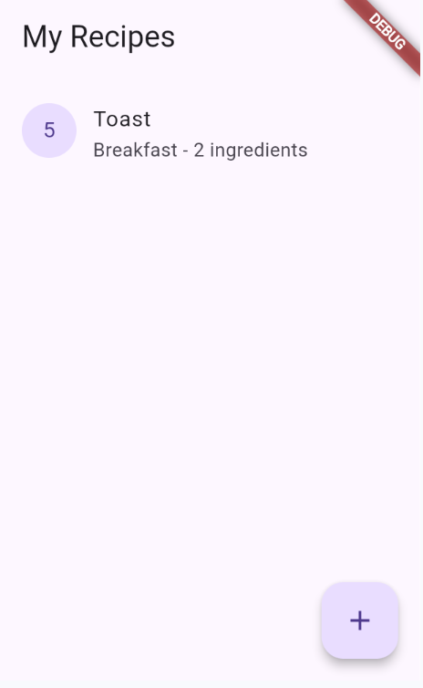
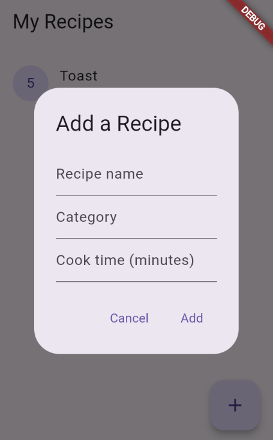
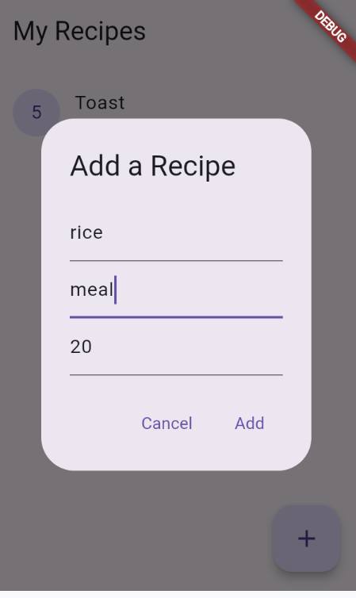
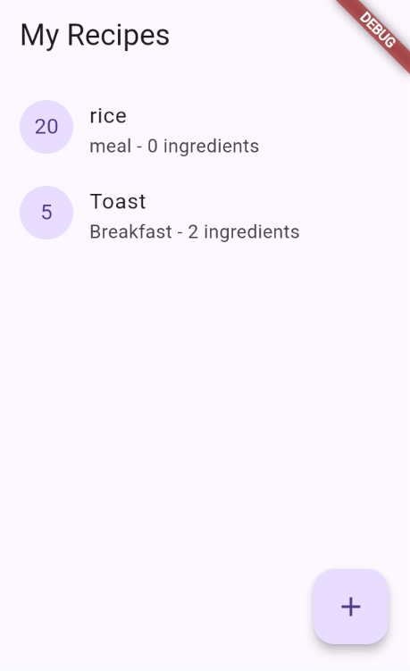

# Recipe List

Recipe List is a simple app to store recipes. It stores name,category, and cook time.

## Who is this for?

This is for someone who wants to simply store recipes.

## What it does

Add a recipe with a name, category, and cook time. Recipes appear as cards showing the cook time and ingredient count. Tap to favorite, long-press to delete.

## Why it's useful

To store recipes real quick so you remember them.

## Screenshots

